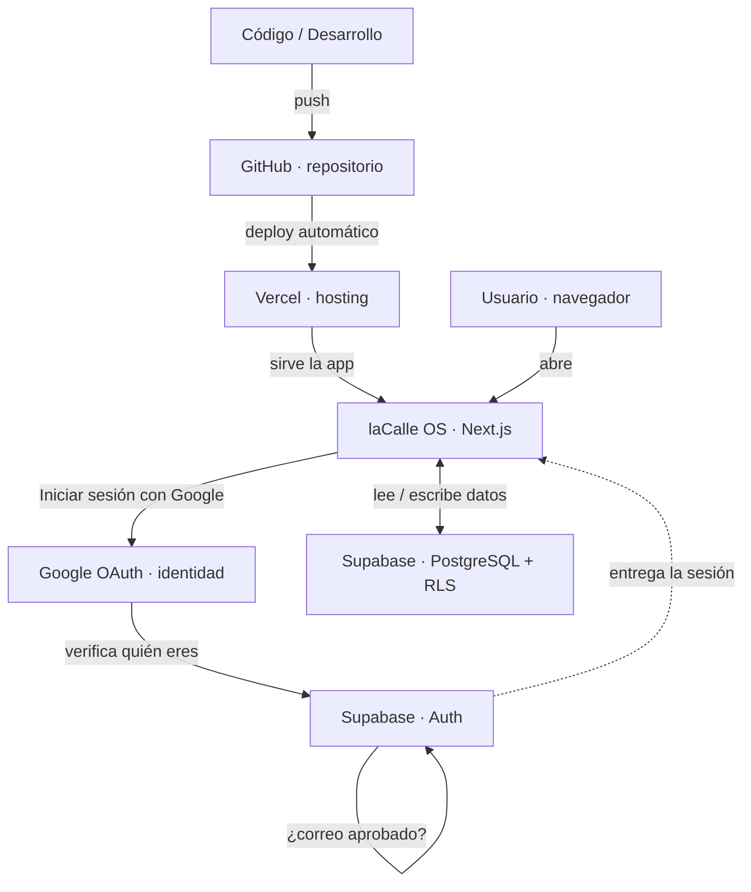

# laCalle OS — Mapa de conexiones

Esquema de qué conecta con qué y qué hace cada plataforma.

## Diagrama

## Qué hace cada plataforma

- **laCalle OS (Next.js):** la aplicación en sí — módulos, interfaz y lógica. Corre local en desarrollo y en Vercel en producción.
- **Supabase:** el cerebro de datos y acceso. Guarda todo por cliente (**PostgreSQL**), gestiona el login (**Auth**) y aplica las reglas de seguridad (**RLS**) para que cada usuario vea solo lo suyo.
- **Google OAuth:** verifica **quién** eres al iniciar sesión. No guarda datos de la app; solo confirma tu identidad y se la entrega a Supabase.
- **Vercel:** sirve la app en una **URL pública** para que el equipo entre sin depender de una máquina local.
- **GitHub:** guarda el **código** y, en cada cambio, dispara el deploy a Vercel.

## Los tres flujos

1. **Código → Producción:** Desarrollo → GitHub → Vercel → app en línea.
2. **Acceso (login):** Usuario → app → "Entrar con Google" → Google verifica identidad → Supabase confirma que el correo está en la lista aprobada → sesión iniciada.
3. **Datos:** la app lee y escribe en Supabase (PostgreSQL); las reglas RLS filtran automáticamente por cliente, así que nadie ve datos de un cliente que no tiene asignado.

## Resumen en una línea

> **GitHub** guarda el código → **Vercel** lo publica → el **Usuario** entra a la app → **Google** confirma su identidad → **Supabase** valida el acceso y guarda/lee los datos por cliente.
