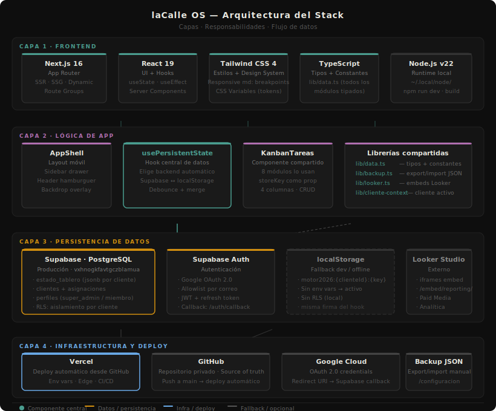

# laCalle OS — Documentación del Proyecto

**Versión:** 1.0.0  
**Deploy:** https://lacalle-os-v2.vercel.app  
**Repositorio:** privado (GitHub, cuenta Agencia laCalle)

---

## Qué es

laCalle OS es el tablero de gestión operacional de Agencia laCalle. Centraliza en un solo lugar el diagnóstico de cada cliente, el seguimiento de todos los servicios activos y las tareas de cada área. Está pensado para uso interno del equipo de la agencia.

---

## Diagrama de arquitectura



> 4 capas: Frontend → Lógica de App → Persistencia → Infraestructura.  
> El nodo central es `usePersistentState`, que abstrae Supabase y localStorage con la misma firma.

---

## Stack tecnológico

| Capa | Tecnología |
|------|-----------|
| Framework | Next.js 16 (App Router) |
| UI | React 19 + Tailwind CSS 4 |
| Lenguaje | TypeScript strict |
| Base de datos | Supabase (PostgreSQL + Auth + RLS) |
| Deploy | Vercel |
| Node local | v22.14.0 (en `~/.local/node/`) |

---

## Arquitectura de persistencia

El hook `usePersistentState(key, initialValue)` abstrae el backend:

- **Producción (Supabase habilitado):** guarda en la tabla `estado_tablero` con RLS por cliente.
- **Desarrollo local (sin Supabase):** guarda en `localStorage` con el namespace `motor2026:{clienteId}:{key}`.

La firma del hook es idéntica en ambos casos. Los componentes no saben en qué backend operan.

### Tabla `estado_tablero`

```sql
cliente_id   uuid   (FK → clientes.id)
clave        text   (ej: "redes:contenidos")
valor        jsonb  (datos serializados)
actualizado_en timestamptz
```

---

## Modelo de acceso

| Rol | Permisos |
|-----|---------|
| `super_admin` | Ve todos los clientes, accede a panel de Administración |
| `miembro` | Solo ve los clientes asignados en `asignaciones` |

El login es exclusivamente con Google OAuth. El registro está cerrado: solo ingresan las direcciones de la allowlist en `perfiles`.

**Cuenta de acceso:** `cmarind@gmail.com` (super_admin)

---

## Estructura del proyecto

```
motor-app/
├── app/
│   ├── (app)/              # Rutas autenticadas (layout con AppShell)
│   │   ├── page.tsx        # Dashboard
│   │   ├── compania/       # Módulo Compañía
│   │   ├── servicios/      # Módulos de servicio (cada uno con su carpeta)
│   │   ├── configuracion/  # Backup y ajustes
│   │   └── admin/          # Panel super_admin
│   ├── login/              # Pantalla de login
│   └── auth/callback/      # Callback OAuth de Supabase
├── components/
│   ├── AppShell.tsx        # Wrapper cliente que gestiona el sidebar móvil
│   ├── Sidebar.tsx         # Sidebar con navegación y selector de cliente
│   ├── KanbanTareas.tsx    # Kanban reutilizable (compartido por todos los módulos)
│   ├── ui.tsx              # Componentes base: PageHeader, Card, Tabs, StatCard…
│   ├── analitica/          # Componentes del módulo Analítica
│   ├── email/              # Componentes del módulo Email Marketing
│   └── web/                # Componentes del módulo Desarrollo Web
├── lib/
│   ├── data.ts             # Tipos y constantes de todos los módulos
│   ├── store.ts            # usePersistentState + uid + hoyISO
│   ├── backup.ts           # Utilidades de export/import JSON
│   ├── looker.ts           # Utilidades para embeds de Looker Studio
│   ├── cliente-context.tsx # ClienteProvider + useClienteActivo
│   └── supabase/           # Config, client, server helpers
├── supabase/
│   └── migrations/         # Schema SQL aplicado
└── docs/                   # Esta documentación
```

---

## Cómo correr localmente

```bash
# Requiere Node 22 — exportar PATH primero
export PATH="$HOME/.local/node/node-v22.14.0-darwin-x64/bin:$PATH"

cd motor-app
npm install
npm run dev      # http://localhost:3000
```

Variables de entorno necesarias en `.env.local`:

```
NEXT_PUBLIC_SUPABASE_URL=https://vxhnogkfavtgczblamua.supabase.co
NEXT_PUBLIC_SUPABASE_ANON_KEY=<publishable key>
```

Sin esas variables, la app corre en modo localStorage (útil para desarrollo sin conexión).

---

## Deploy en Vercel

1. Push a `main` en GitHub → Vercel despliega automáticamente.
2. Las variables de entorno están configuradas en el panel de Vercel.
3. El dominio de producción es `lacalle-os-v2.vercel.app`.

---

## Backup y restauración

Desde **Configuración** en el sidebar:

- **Exportar:** descarga `lacalle-os-backup-YYYYMMDD.json` con todos los datos del cliente activo.
- **Importar:** sube un archivo de backup para restaurar el estado. Los datos existentes se sobrescriben.

Se recomienda exportar un backup antes de cada migración o cambio de cliente.
